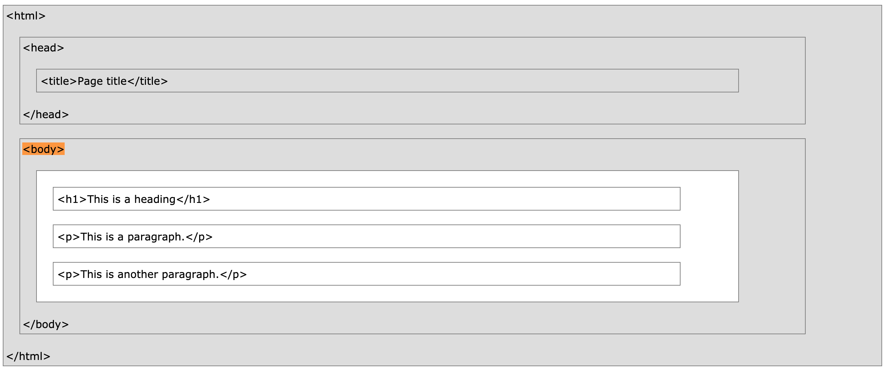

## Structure Visualisation 


We can see that there is a structure to our HTML document. 

Our html element wraps everything else inside of it. The head wraps all of our meta data.

And the body wraps all of the content we want to to display onto the web page. Only the content inside the body section gets displayed by the browser. 

```
<!DOCTYPE html>
<html>
    <head>
        <meta charset="utf-8">
        <title>Page Title</title>
    </head>
    <body>
        <h1>My First Heading</h1>
        <p>My first paragraph.</p>
    </body>
</html>
```